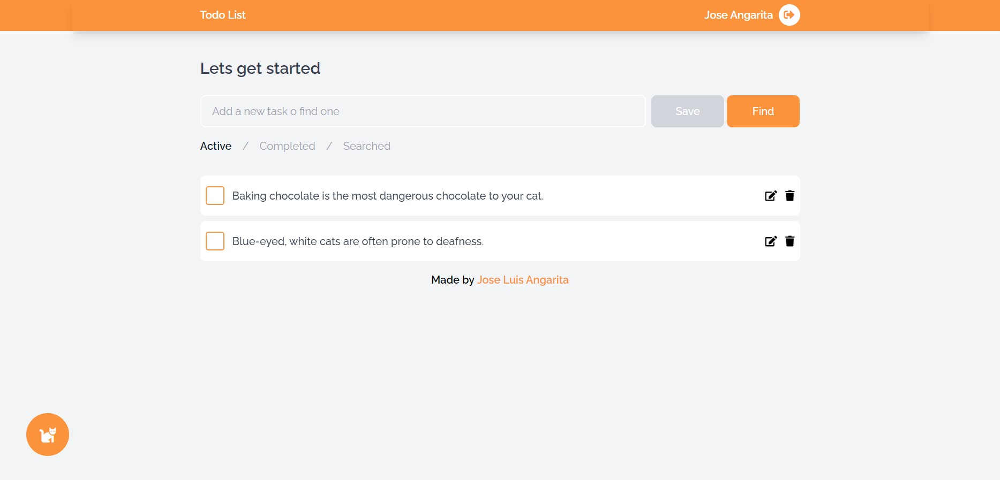

<!-- Please update value in the {}  -->

<h1 align="center">ToDo App</h1>

<div align="center">
   Prueba para desarrollador frontend - LYA ELECTRONIC
</div>

<div align="center">
  <h3>
    <a target="_blank" href="https://to-do-frontend-mu.vercel.app">
      Aplicación desplegada
    </a>
  </h3>
</div>


## Overview



La aplicación le permite al usuario:

- Crear una cuenta o iniciar sesión con una cuenta antes creada
- Crear, editar y eliminar tareas.
- Agregar frases aleatorias de gatos, el numero que desee.
- Buscar una tarea en especifico.

### Frontend Built With


- [React](https://reactjs.org/)
- [Redux](https://es.redux.js.org)
- [Tailwind](https://tailwindcss.com/)
- [MUI](https://mui.com)
- [SASS](https://sass-lang.com)
- [REACT HOT TOAST](https://react-hot-toast.com)

## Extra Info

Para mantener la información de las tareas persistente y permitir la creacion y autenticación de usuarios, se creó un Backend exclusivo para la aplicación.
- [REPOSITORIO BACKEND](https://github.com/Jocanm/ToDo-Backend)

## Backend Built With

- [EXPRESS](https://expressjs.com/es/) - Para la creación de las rutas
- [MONGODB](https://www.mongodb.com/es) - Como base de datos
- [PRISMA.IO](https://www.prisma.io) - Como ORM
- [JSONWEBTOKENS](https://www.npmjs.com/package/jsonwebtoken) - Para la autenticación
- [BCRYPT](https://www.npmjs.com/package/bcrypt) - Para la encriptación

## Despliegue

- El frontend se encuentra desplegado en [VERCEL](https://vercel.com/dashboard)
- El Backend se encuentra desplegado en [HEROKU](https://dashboard.heroku.com). Debido a que el Backend se encuentra desplegado con el tier gratuito, puede que la primera vez que se intente iniciar sesión o registrarse en la aplicación esta demore entre 10 a 15 segundos en realizar la petición.

```bash
# Install dependencies
$ yarn install
```